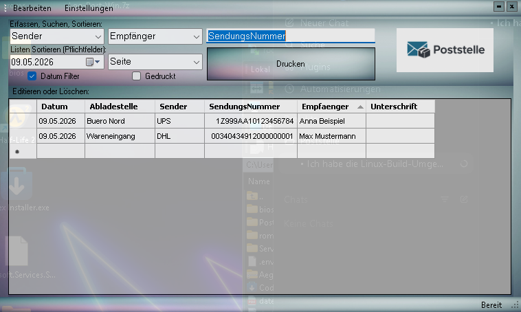

# Poststelle

`Poststelle` ist eine kleine Windows-Desktop-Anwendung zur Erfassung eingehender Sendungen.

Sie speichert Pakete und Empfaenger in einer lokalen SQLite-Datenbank, zeigt offene Eintraege in einer Tabelle an und unterstuetzt die schnelle Erfassung ueber Sender, Empfaenger und Sendungsnummer.

## Screenshot

## Funktionen

- Erfassung eingehender Pakete und Sendungen
- Verwaltung von Empfaengern mit Name, Abladestelle und Mandant
- Filtern und Suchen nach Datum, Seite, Sender, Empfaenger und Sendungsnummer
- Druckansicht und Ausdruck der offenen Liste
- lokale SQLite-Speicherung ohne externen Server
- einfache Backup-Einstellungen fuer die Datenbank
- erste Scan-/Barcode-Unterstuetzung fuer Sendungsnummern mit Carrier-Erkennung und gespeicherten Zuordnungsregeln

## Technischer Stand

- Sprache: VB.NET
- UI: WinForms
- Framework: .NET Framework 4.6.1
- Datenbank: SQLite
- Plattform: Windows

## Datenhaltung

Die Anwendung legt ihre SQLite-Datenbank standardmaessig im Benutzerprofil ab:

- `%LOCALAPPDATA%\Poststelle\Poststelle.db`

Dort liegt auch der Standardpfad fuer lokale Backups.

## Nutzung

1. Empfaenger pflegen
2. Sender, Empfaenger und Sendungsnummer eingeben oder scannen
3. Paket speichern
4. Offene Liste pruefen, filtern und bei Bedarf drucken

## Build

Zum Bauen wird eine Windows-Umgebung mit Visual Studio 2017 oder neuer benoetigt.

Voraussetzungen:

- .NET Framework 4.6.1 Developer Pack
- lokale SQLite-Bibliotheken im Projekt unter `Poststelle/lib/sqlite`

Build-Dateien:

- `Poststelle.sln`
- `Poststelle/Poststelle.vbproj`

## Download und SmartScreen

Die Release-Dateien werden als ZIP ueber GitHub Releases bereitgestellt.

Hinweis zu Windows SmartScreen:

- Die Anwendung ist nicht digital signiert.
- Deshalb kann Windows beim ersten Start `Unbekannter Herausgeber` anzeigen.
- Das ist bei kleinen, nicht signierten Desktop-Tools normal.

Zur Pruefung eines Downloads:

- ZIP nur aus dem offiziellen GitHub Release laden
- bereitgestellte `SHA256SUMS.txt` mit der lokalen Datei vergleichen
- Quellcode und Release stammen aus demselben oeffentlichen Repository

Eine kurze Startanleitung steht in `INSTALL.md`.
